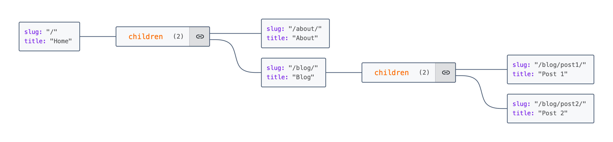

# Folder2Sitemap README

## Overview
Folder2Sitemap is a Node.js script designed to generate a JSON representation of a website's structure based on its directory and file organization. It scans a specified directory for HTML files, particularly looking for [index.html](example.com/index.html#1%2C1-1%2C1) files in each directory to determine the structure of the website. The script extracts the title of each page from the `<title>` tag in the HTML files and uses the directory structure to create a hierarchical JSON object representing the site's structure.

## Features
- **Title Extraction**: Extracts titles directly from the HTML files to accurately represent each page.
- **Recursive Directory Traversal**: Scans directories recursively to build a nested structure of the website.
- **JSON Output**: Outputs the website structure in a readable JSON format.

## Dependencies
Folder2Sitemap relies on the following dependencies:
- [jsdom](package.json#3%2C6-3%2C6): For parsing HTML content. Ensure you have it in your [package.json](package.json#1%2C1-1%2C1) dependencies.
```json:package.json
  "dependencies": {
    "jsdom": "^24.0.0"
  }
```

## Installation
1. Ensure you have Node.js installed on your system.
2. Clone this repository or download the script to your local machine.
3. Install the required dependencies by running `npm install` in the directory where the script is located.

## Usage
To use Folder2Sitemap, run the script from the command line, passing the path to the root directory of your website as an argument:

```bash
node folder2sitemap.js /path/to/your/website
```

The script will output the structure of your website in JSON format to the console. You can redirect this output to a file if needed:

```bash
node folder2sitemap.js /path/to/your/website > site_structure.json
```

### Saving Output to a File Directly
To save the output directly to a file, use the `--output` flag followed by the file name:

```bash
node folder2sitemap.js /path/to/your/website --output site_structure.json
```

## Example Output
Given a website with a simple structure, the output might look like this:

```json
{
  "slug": "/",
  "title": "Home",
  "children": [
    {
      "slug": "/about/",
      "title": "About"
    },
    {
      "slug": "/blog/",
      "title": "Blog",
      "children": [
        {
          "slug": "/blog/post1/",
          "title": "Post 1"
        },
        {
          "slug": "/blog/post2/",
          "title": "Post 2"
        }
      ]
    }
  ]
}
```

## Visualizing the Sitemap
You can use online tools like [JSON Crack](https://jsoncrack.com/) to visualize the JSON output in a more structured format. Simply paste the JSON output into the tool to see a visual representation of the website structure.



## Contributing
Contributions to Folder2Sitemap are welcome. Please ensure you follow the existing code structure and submit a pull request for any enhancements or bug fixes.

## License
Folder2Sitemap is released under the MIT License. See the LICENSE file for more details.